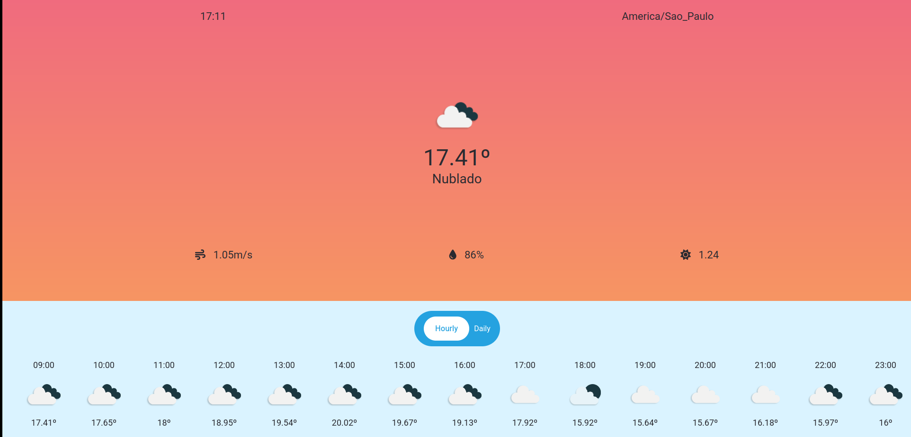

# weather-app

<div align="center">
  
</div>

Responsive and minimalist Weather app integrated with OpenWeather API, that shows you current weather and forecasts based on your location.

## To build locally

## Customize configuration

### Install the dependencies

```sh
npm install
```

### Compile and Hot-Reload for Development

```sh
npm run dev
```

### Compile and Minify for Production

```sh
npm run build
```

### Lint with [ESLint](https://eslint.org/)

```sh
npm run lint
```
